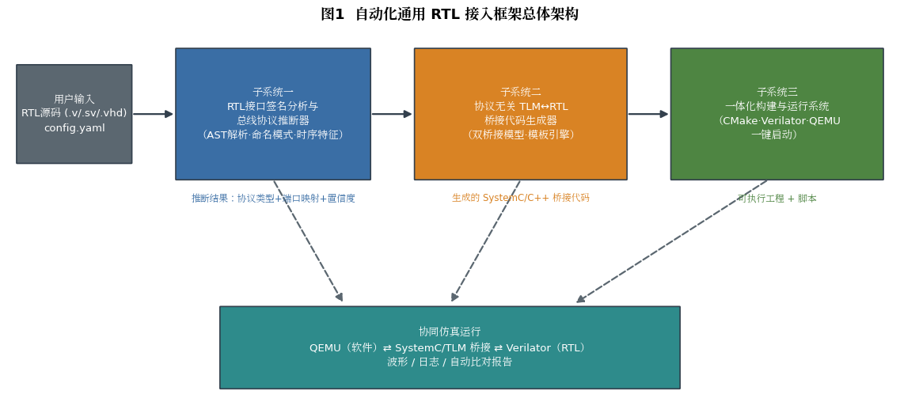
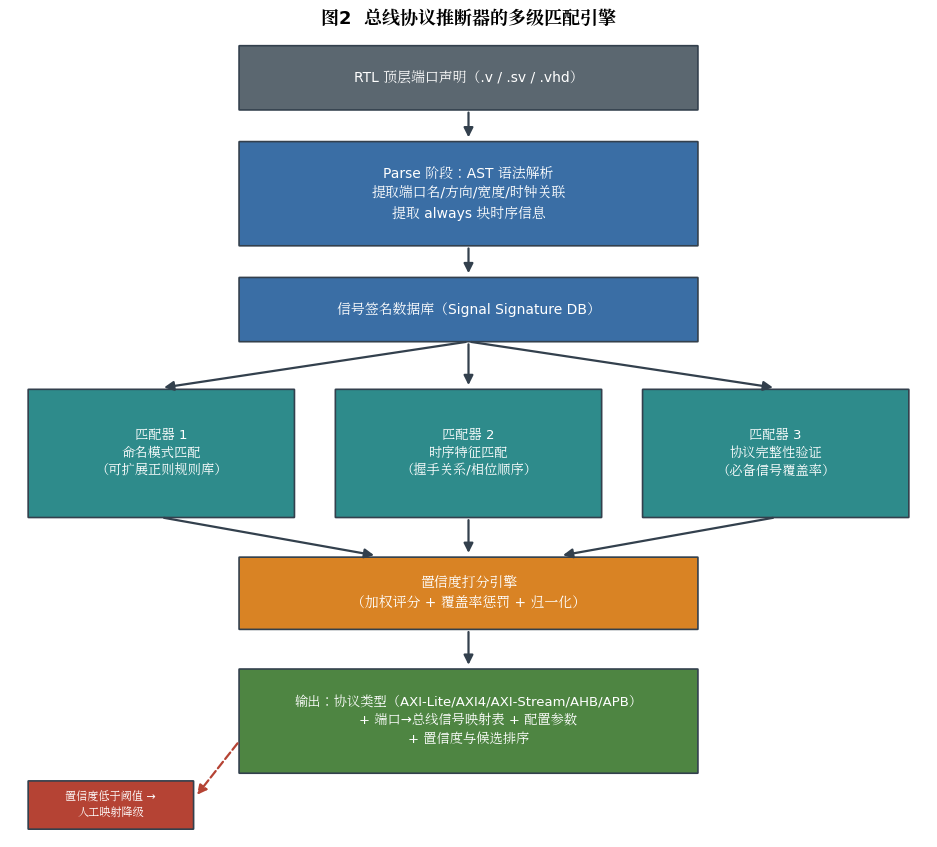
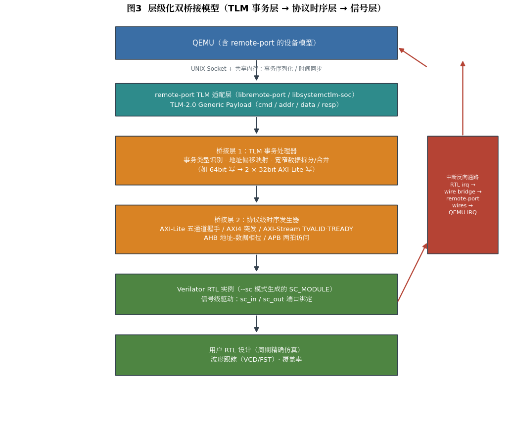
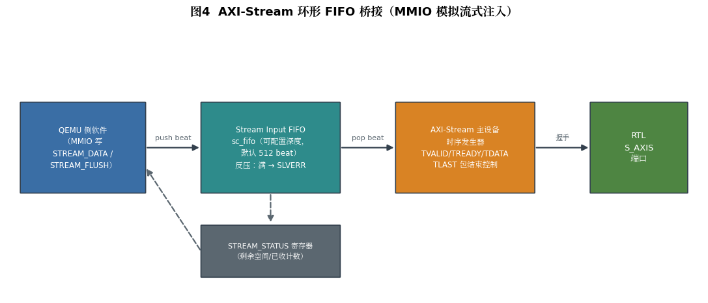
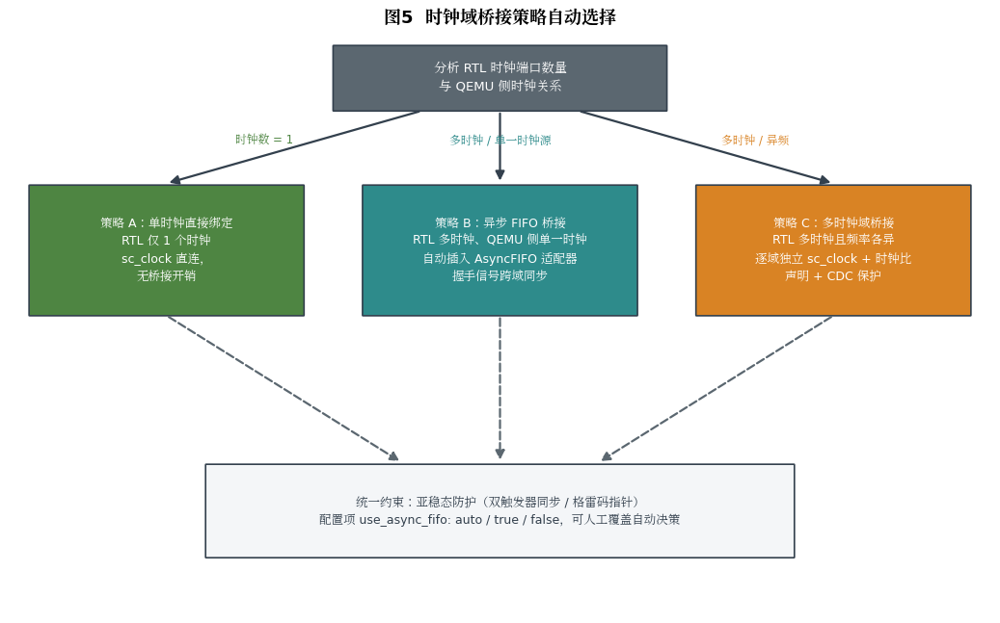
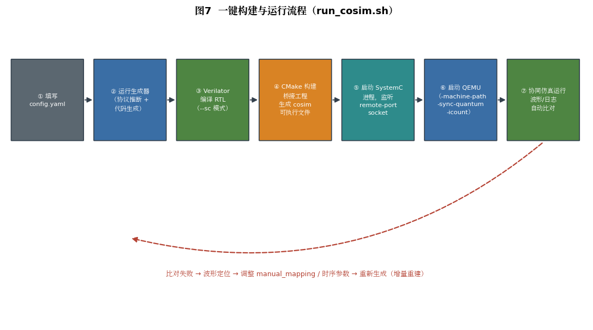
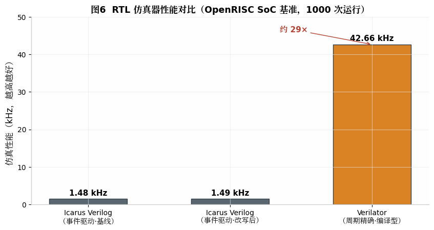

# Automated Universal RTL Integration Framework — Complete Technical Design Report

## Abstract

This report addresses the engineering goal of "integrating any RTL IP core into a QEMU virtual platform with a single command" and presents the complete technical design of an automated universal RTL integration framework. The framework consists of three core subsystems: **Subsystem 1** (RTL interface signature analysis and bus protocol inference) performs AST-level parsing of the user-supplied Verilog/SystemVerilog/VHDL top level, and uses a three-stage engine — "naming pattern matching + timing feature matching + protocol completeness verification" — to automatically infer bus protocol types such as AXI-Lite, AXI4, AXI-Stream, AHB, and APB, producing a port mapping and a confidence score; **Subsystem 2** (protocol-agnostic TLM↔RTL bridge code generator) is built on a layered dual-bridge model (TLM transaction handler + protocol-level timing generator) and uses a template engine to automatically generate SystemC bridge code that converts QEMU transactions into RTL signal-level handshakes; **Subsystem 3** (integrated build-and-run system) automatically generates the complete project directory, CMake build scripts, and a one-command launch script, connecting the full pipeline of "fill in configuration → code generation → compilation → co-simulation → automatic comparison."

This report is a comprehensive rewrite and deepening of the original draft: it corrects technical errors in the draft regarding the Verilator signal binding method, QEMU launch parameters, and the confidence normalization formula; and it supplements missing content including the QEMU remote-port time synchronization mechanism, the interrupt reverse path, the required-signal completeness sets for each protocol, validation metrics, performance optimization strategies, a risk list, and an implementation roadmap. The engineering feasibility of the framework rests on a mature open-source ecosystem: QEMU and the external simulator exchange transactions and synchronize time via the **remote-port** mechanism over sockets and shared memory[^2^]; on the SystemC side, libsystemctlm-soc provides standard TLM-2.0 wrappers[^4^]; and on the RTL side, Verilator compiles the design in `--sc` mode into an SC_MODULE that can be instantiated directly in a SystemC netlist[^12^].

---

## 1. Design Goals and Overall Architecture

### 1.1 Design Goals

A long-standing pain point of hardware/software co-verification is that every time a new RTL IP core is integrated, engineers must hand-write the QEMU device model, the SystemC bridge layer, and the test environment — a repetitive and error-prone effort. The core design goal of this framework is to **offload the automatable 80% of this work to the tool**, exposing only the parts that genuinely require human judgment (protocol confirmation, port-mapping correction, performance parameter tuning) to the user in the form of a configuration file. Concretely, the framework must meet four goals: first, **automatic protocol identification** — the user need not declare which bus the RTL uses; the framework infers it from port naming and timing behavior, and when confidence is insufficient it presents ranked candidates for human confirmation; second, **automatic bridge code generation** — all bridge-layer code is produced by template rendering, and the user never writes any SystemC/C++ code directly; third, **one-command build and run** — from filling in the configuration file to seeing the co-simulation comparison report, only a single command is required; fourth, **degradable and overridable** — every automatic inference result can be manually overridden via configuration items such as `manual_mapping`, so the framework remains usable even when inference fails.

The framework's scope of applicability must be stated clearly. The framework targets **slave/peripheral-type RTL IP cores with standard bus interfaces** — register-based accelerators, streaming data processors, simple peripherals, and the like, which constitute the bulk of co-simulation demand. For RTL with master interfaces (actively initiating DMA), multi-level interconnect structures, or strong analog/mixed-signal behavior, the framework provides template skeletons but does not promise fully automatic integration; such scenarios are discussed further in the risks and limitations of Chapter 7.

### 1.2 Overall Architecture

The overall architecture of the framework is shown in Figure 1, organized as a three-stage "inference → generation → execution" pipeline. The three subsystems are decoupled through two well-defined intermediate artifacts: Subsystem 1 outputs the **protocol inference result** (protocol type, port→bus-signal mapping table, configuration parameters, confidence) to Subsystem 2, and Subsystem 2 outputs a **complete bridge code library** (SystemC source files, QEMU-side device stub, build scripts) to Subsystem 3. This decoupling brings two engineering benefits: on one hand, each subsystem can iterate independently — for example, adding support for a new protocol to the inferencer only requires extending the rule library and templates, with no changes to the build system; on the other hand, the intermediate artifacts are all human-readable YAML/JSON and C++ code, so the user can intervene and modify at any stage, consistent with the design philosophy of "automation first, human takeover always possible."



At runtime, the architecture organizes QEMU and the RTL simulator as **separate processes**: QEMU runs the guest software, the SystemC+Verilator process runs the RTL simulation, and the two communicate via the remote-port protocol. This choice is consistent with the Xilinx/AMD co-simulation solution — remote-port is the low-level mechanism by which QEMU connects to external simulation environments, transferring transactions and synchronizing time between simulators over sockets and shared memory[^2^]; libsystemctlm-soc serializes/deserializes QEMU transactions into TLM Generic Payloads, making QEMU look like an ordinary TLM-2.0 module on the SystemC side[^4^]. Compared with compiling a device model directly into QEMU, the separate-process architecture offers significant advantages: low invasiveness, convenient debugging (each side can be debugged independently with GDB/waveform tools), and no need to recompile QEMU when the RTL changes.

### 1.3 Key Technology Choices and Rationale

The framework's technology selection follows the principle of "mature open-source components first; avoid reinventing the wheel." The core technology stack and the rationale for each choice are shown in the table below.

| Technical Area | Choice | Rationale |
| --- | --- | --- |
| QEMU↔SystemC communication | remote-port (libremote-port) + libsystemctlm-soc | Transaction protocol based on sockets + shared memory, with native support for time synchronization and interrupt lines (wires); adopted by the AMD co-simulation solution and commercial toolchains[^2^][^15^] |
| RTL simulation engine | Verilator (`--sc` mode) | Compiled, cycle-accurate simulation; roughly two orders of magnitude faster than interpreted simulators single-threaded, and can directly generate an SC_MODULE[^12^][^32^] |
| Transaction-level modeling standard | SystemC TLM-2.0 (LT style + Generic Payload) | Industry standard, directly compatible with the libsystemctlm-soc wrappers[^4^] |
| RTL parsing | Pyverilog (Verilog) + slang/Surelog (SystemVerilog alternative) | Pyverilog provides a complete Python toolchain for parsing, dataflow, and control-flow analysis[^27^]; it only supports Verilog-2005, so SV sources must be preprocessed with sv2v or handled by switching to slang[^28^] |
| Code generation | Jinja2 template engine | Shares the Python technology stack with the inferencer; templates are readable and easy for users to customize and extend |
| Build system | CMake + Verilator CMake integration | Automatically handles Verilator compilation, SystemC linking, and dependency detection |

One prerequisite constraint must be made explicit to users: **remote-port is not a built-in feature of upstream QEMU**. It is provided by the QEMU fork maintained by Xilinx, and must be enabled via dedicated command-line options such as `-machine-path`, `-sync-quantum`, and `-icount`, together with a co-simulation device tree (`-hw-dtb`)[^2^][^25^]. The framework therefore supports two QEMU-side deployment forms: the preferred form is based on the Xilinx QEMU fork (remote-port works out of the box, but machine types are mainly Zynq/Versal); the general form generates a lightweight device stub (`qemu_device_stub.c`) for upstream QEMU, with remote-port client logic embedded in the stub, thereby extending the framework to generic machine types such as `virt` — this was also the design intent of `qemu/qemu_device_stub.c` in the draft's directory structure. This report provides the complete design of its generated content and launch parameters in Sections 3.2 and 4.4.

---

## 2. Subsystem 1: RTL Interface Signature Analysis and Bus Protocol Inference

### 2.1 Syntax Parsing and Feature Extraction

The inferencer's input is the user's RTL top-level source code, and its output is structured **port metadata** and **timing features**. The parsing stage is based on an AST (abstract syntax tree) rather than regular-expression text scanning, because only an AST can reliably distinguish port declarations, internal signals, parameterized width expressions, and signal references inside always blocks. For Verilog-2005 sources, Pyverilog is an ideal parsing foundation: it provides a complete toolchain from parser (vparser) to dataflow analysis (dataflow) to control-flow analysis (controlflow), and its control-flow analyzer can identify under which conditions each signal is activated — exactly the capability required by the timing feature matching in Section 2.3[^27^]. Note that Pyverilog depends on Icarus Verilog for preprocessing (`iverilog -E`) and only supports Verilog-2005 syntax[^27^]; for SystemVerilog sources, the framework offers two paths — the lightweight path converts SV to Verilog with sv2v first and then parses[^28^], while the heavyweight path integrates a full SV front end such as slang/Surelog directly. By default the framework adopts the lightweight "Pyverilog + sv2v" path, with slang as an optional back end, to control deployment dependency complexity.

The product of the parsing stage is defined by the following data structures (illustrative):

```python
@dataclass
class Port:
    name: str            # port name, e.g. "S_AXI_AWADDR"
    direction: str       # input / output / inout
    width: int           # bit width (parameterized expressions evaluated at parse time)
    clock: str | None    # associated clock domain (filled in by the clock association analysis of Section 2.3)

@dataclass
class ModuleSignature:
    module_name: str
    ports: list[Port]
    clocks: list[str]          # all identified clock ports
    resets: list[dict]         # reset ports and their active polarity
    timing_features: list[str] # timing feature labels, see Section 2.3
```

Extracting the port metadata itself is straightforward; what genuinely needs design is the **clock/reset association analysis** — determining which clock domain each bus port belongs to. The implementation approach is: collect all clock candidates from the sensitivity lists of always blocks (signals with `posedge/negedge` events), then perform fan-in analysis on the dataflow graph, marking the clock of the always block to which each port's register logic belongs as that port's associated clock. This information feeds the automatic selection of the clock-domain bridging strategy in Section 3.8. Reset polarity is determined by a dual check: the edge direction of the reset signal in the sensitivity list (`posedge rst` → active-high, `negedge rst_n` → active-low) combined with naming heuristics (`_n`/`_b` suffixes).

### 2.2 Naming Pattern Matching Rule Library

Naming pattern matching is the first stage of inference, built on the empirical fact that bus signal naming follows strong conventions. The rule library is organized per protocol as extensible regular-expression sets, with each protocol annotated with **required signals** and **optional signals**. The table below summarizes the rule library for the five supported protocols (rules are matched after case normalization of port names and stripping of common prefixes):

| Protocol | Required Naming Patterns (Core Groups) | Optional Naming Patterns | Distinguishing Feature |
| --- | --- | --- | --- |
| AXI-Lite | `AWADDR/AWVALID/AWREADY`, `WDATA/WVALID/WREADY`, `BRESP/BVALID/BREADY`, `ARADDR/ARVALID/ARREADY`, `RDATA/RRESP/RVALID/RREADY` | `AWPROT/WSTRB/ARPROT` | All five channels present but **no burst signals** (no `AWLEN/AWBURST`) |
| AXI4 (Full) | In addition to AXI-Lite: `AWLEN/AWSIZE/AWBURST`, `WLAST`, `ARLEN/ARSIZE/ARBURST`, `RLAST` | `AWID/BID/ARID/RID`, `AWQOS/AWREGION` | The presence of burst control signals is the decisive evidence distinguishing it from AXI-Lite |
| AXI-Stream | `TDATA/TVALID/TREADY` | `TLAST/TKEEP/TSTRB/TID/TDEST/TUSER` | No address channel; `TLAST` marks packet boundaries |
| AHB | `HADDR/HWDATA/HRDATA/HWRITE/HTRANS/HREADY` | `HRESP/HSIZE/HBURST/HPROT/HSEL` | `HTRANS` transfer type + address/data phase overlap |
| APB | `PADDR/PWDATA/PRDATA/PWRITE/PSEL/PENABLE` | `PREADY/PSLVERR/PPROT/PSTRB` | The two-cycle `PSEL` + `PENABLE` structure is unique |

The rule library is stored in standalone YAML files rather than hard-coded in Python classes — an engineering improvement over the draft: when users encounter vendor-customized naming (e.g., Xilinx-style lowercase `s_axi_awaddr`, or instance-numbered forms like `S00_AXI_*`), they only need to append patterns to the rule library without modifying the inferencer code. Uniform preprocessing of port names before matching — stripping instance prefixes (e.g., `S00_`, `m01_`), case normalization, and collapsing underscore variants — significantly improves the rule library's reuse rate.

### 2.3 Timing Feature Matching

When port names are abbreviated, obfuscated, or customized such that naming matching cannot uniquely determine the protocol, inference moves to the second stage: extracting **handshake behavior features** from always blocks. Timing feature extraction is based on Pyverilog's control-flow analysis, which can already identify "under which combination of conditions a signal is assigned"[^27^]; the inferencer generalizes these into protocol-level behavior patterns. The core feature labels defined include: `VALID_READY_HANDSHAKE` (the assertion condition of one output signal references another signal, and the two signals exhibit a valid/ready interlock, pointing to the AXI family); `APB_TWO_PHASE` (a `PENABLE`-like signal asserts strictly one cycle after a `PSEL`-like signal, pointing to APB); `AHB_ADDR_DATA_OVERLAP` (the update condition of the write-data register references address-phase signals from the previous cycle, pointing to AHB's pipelined phase structure); `BURST_COUNTER` (a transfer counter that increments/decrements with handshakes and is coupled to a `LAST`-like signal, pointing to AXI4 bursts or AXI-Stream packets).

The value of timing feature matching lies not only in serving as a fallback when naming fails, but also in **cross-validation**: when naming patterns and timing features point to the same protocol, confidence increases significantly; when the two conflict (e.g., port names look like AXI-Lite but a burst counter exists behaviorally), the inferencer should surface the conflict itself as important information to the user — this usually means the RTL implements a non-standard protocol subset or superset, and automatic bridge generation needs human confirmation. In the draft, timing analysis served only as a scoring bonus; this report upgrades it to the dual responsibility of both "scoring" and "conflict detection."

### 2.4 Confidence Scoring Algorithm

The scores from the three stages of matching converge into the scoring engine. Relative to the draft, this report fixes three flaws in the scoring algorithm: first, the draft's confidence formula `confidence = s_best / Σs` divides by zero when all protocol scores are zero; second, "double counting by port × pattern" in naming matching causes scores to grow linearly with the number of ports, making scores incomparable across IPs of different sizes; third, the coverage penalty (score multiplied by 0.2 when `coverage < 0.5`) is a hard-threshold jump whose behavior is unstable near the boundary. The corrected algorithm is as follows:

```python
class ProtocolInferenceEngine:
    W_NAME, W_TIMING = 1.0, 2.0   # naming match weight / timing feature weight
    TAU_ACCEPT = 0.60             # auto-accept threshold

    def infer(self, sig: ModuleSignature) -> dict:
        scores = {}
        for proto, rules in RULESET.items():
            # naming score: normalized by "signal-group hit rate", decoupled from total port count
            groups_hit = sum(1 for g in rules.required_groups
                             if any(match(p, g) for p in sig.ports))
            s_name = self.W_NAME * groups_hit / len(rules.required_groups)

            # timing score: feature label -> protocol mapping, added on each hit
            s_timing = self.W_TIMING * sum(
                1 for f in sig.timing_features if proto in TIMING_MAP.get(f, []))

            # coverage: soft penalty (linear), no penalty when coverage >= 0.8
            coverage = self.signal_coverage(proto, sig.ports)
            penalty = min(1.0, coverage / 0.8)

            scores[proto] = (s_name + s_timing) * penalty

        total = sum(scores.values())
        if total == 0:                      # fix: division-by-zero guard
            return self.fallback_manual(sig)

        best = max(scores, key=scores.get)
        confidence = scores[best] / total   # normalized to (0,1]
        ranked = sorted(scores.items(), key=lambda kv: -kv[1])
        return {
            "protocol": best if confidence >= self.TAU_ACCEPT else None,
            "confidence": round(confidence, 3),
            "candidates": ranked[:3],       # Top-3 candidates for manual selection
            "conflicts": self.detect_conflicts(sig),  # naming/timing conflicts
            "port_mapping": self.build_mapping(best, sig),
        }
```

The corrected algorithm has three desirable properties: scores are independent of IP size (the naming component is normalized by signal groups); the coverage penalty is continuous and behaves smoothly; and the confidence falls in the (0,1] interval with a clear semantics — the proportion of the best protocol's score among all candidate scores. When the confidence falls below the threshold τ (default 0.60), the framework does not commit to a single conclusion but outputs the Top-3 candidates with their scores, guiding the user to explicitly specify `bridge.protocol` in the configuration file (see Section 4.2), achieving the "automatic inference + human confirmation" synergy.

### 2.5 Required-Signal Completeness Sets per Protocol

Protocol completeness verification relies on each protocol's **required-signal completeness set** (REQUIRED_SET), which serves both the coverage computation of the scoring algorithm and the signal sanity check during bridge code generation. The table below gives the framework's built-in completeness set definitions:

| Protocol | Required Signals (bridge cannot be generated if missing) | Optional Signals (defaults used if missing) |
| --- | --- | --- |
| AXI-Lite | AWADDR, AWVALID, AWREADY, WDATA, WVALID, WREADY, BRESP, BVALID, BREADY, ARADDR, ARVALID, ARREADY, RDATA, RRESP, RVALID, RREADY, ACLK, ARESETn | WSTRB (default all 1s), AWPROT/ARPROT (default 3'b000), BRESP/RRESP can be synthesized by the bridge layer when the RTL always returns OKAY |
| AXI4 | All of AXI-Lite + AWLEN, AWSIZE, AWBURST, WLAST, ARLEN, ARSIZE, ARBURST, RLAST | ID family (default 0), AWQOS, AWREGION, RRESP |
| AXI-Stream | TDATA, TVALID, TREADY, ACLK, ARESETn | TLAST (treated as fixed packet length if absent), TKEEP (default all 1s), TID/TDEST/TUSER |
| AHB | HADDR, HWDATA, HRDATA, HWRITE, HTRANS, HREADY, HCLK, HRESETn | HSEL (driven constant by the bridge layer in single-chip-select cases), HRESP, HSIZE, HBURST |
| APB | PADDR, PWDATA, PRDATA, PWRITE, PSEL, PENABLE, PCLK, PRESETn | PREADY (bridge layer completes in one cycle if absent), PSLVERR |

The significance of the completeness sets is to give "successful inference" a decidable engineering criterion: naming matching and timing features yield probabilistic conclusions, whereas the existence of required signals is a hard prerequisite. For example, if an RTL implements only the write channels of AXI-Lite (no AR/R channels), the completeness check immediately detects the missing read channels; instead of silently generating a bridge whose read operations time out forever, the framework degrades to a "write-only device" template and clearly informs the user.

### 2.6 Edge Handling and Degradation Strategies

The inferencer must assume that real-world RTL input is imperfect, and the framework defines four degradation levels. **Level 1, partially unrecognized ports**: ports matching no rule are marked `UNKNOWN` and kept as-is in the mapping table; hook functions for user-defined handling are reserved for them in the generated code, and each is listed individually in the report. **Level 2, mixed protocols**: a top level exposing both an AXI-Lite control port and an AXI-Stream data port is the typical shape of an accelerator; the inferencer clusters ports into "interface groups" (grouped by port prefix + clock domain), infers each group independently, outputs multiple result sets, and the bridge generator produces an independent bridge instance for each group. **Level 3, insufficient confidence**: output the Top-3 candidates and wait for the user to specify explicitly in `config.yaml`. **Level 4, inference completely impossible**: fall back to "manual mode" — generate a template project containing only signal declarations and a simulation skeleton, leaving the protocol timing sections blank for the user to fill in; the framework still provides the build system and run scripts, ensuring the user gains the full value of Subsystem 3 even in the worst case.

The design principle common to all four degradation paths is **never fail silently**: every degradation writes an `inference_report.json` and a human-readable `inference_report.md` in the generated project root, recording the inference rationale (which rules were hit, what the coverage was, which ports were unrecognized), making the debugging of the automatic inference behavior itself a reviewable exercise.



---

## 3. Subsystem 2: Protocol-Agnostic TLM↔RTL Bridge Code Generator

### 3.1 Layered Dual-Bridge Model

The bridge generator is the core innovation of the framework. Its design difficulty lies in spanning three abstraction levels: on the QEMU side there are byte-granularity memory read/write requests ("write 4 bytes to physical address 0xA000_0004"); at the TLM layer there are transaction objects with addresses and data pointers; and on the RTL side there are signal levels toggling cycle by cycle. If a single monolithic module were used to span all three levels, the templates would explode with the number of protocols and could not be reused. The framework therefore adopts a **layered dual-bridge model** (Figure 3): **Bridge Layer 1 (TLM transaction handler)** is protocol-agnostic and handles transaction reception, address offset mapping, wide/narrow data splitting/merging, and response assembly — all five protocols share the same implementation; **Bridge Layer 2 (protocol-level timing generator)** is protocol-specific and translates the "atomic beat requests" produced by Bridge Layer 1 into the signal-level handshake sequences of a concrete bus, with an independent template per protocol. After this layering, adding support for a new protocol only requires adding one Bridge Layer 2 template; Bridge Layer 1 and the QEMU-side code remain completely untouched — this is exactly what "protocol-agnostic" in the title means.

The runtime data path of the dual-bridge model is shown in Figure 3: QEMU transactions arrive at the SystemC process serialized via remote-port and are restored to TLM-2.0 Generic Payloads by the remote-port TLM adaptation layer; the `b_transport` callback of Bridge Layer 1 splits the transaction into a bus-width beat sequence pushed into a request queue; the timing threads of Bridge Layer 2 consume the queue beat by beat and drive the ports of the SC_MODULE generated by Verilator; interrupts return along the reverse path — the RTL's interrupt outputs are converted by the wire bridge module into remote-port wires messages delivered to QEMU[^16^]. Queue decoupling is the key to this model: `b_transport` is a blocking-style interface that should return promptly to maintain the progression efficiency of loosely-timed (LT) simulation, while the RTL handshake takes multiple clock cycles; a FIFO queue buffers between the two, letting the TLM world's "instantaneous transactions" and the RTL world's "multi-cycle handshakes" each get what they need.



### 3.2 QEMU-Side Integration: remote-port and Time Synchronization

The mechanistic foundation of QEMU-side integration is remote-port. remote-port uses UNIX sockets and shared memory to pass transaction messages and time synchronization messages between the QEMU process and the simulator process. At startup, QEMU uses `-machine-path` to specify a directory in which to create the shared memory files and named sockets; the SystemC side, acting as a client, connects to sockets of the form `qemu-rport-_cosim@0` under that directory[^2^][^20^]. libsystemctlm-soc provides ready-made wrappers on the SystemC side — `remote-port-tlm-memory-master` carries the TLM transaction path and `remote-port-tlm-wires` carries the interrupt-line path; the bridge top level generated by the framework instantiates these two kinds of modules directly rather than building up from the raw socket protocol[^4^][^16^].

Time synchronization is the most easily overlooked yet most correctness-critical aspect of co-simulation. QEMU and SystemC each maintain their own virtual time axis; without synchronization, software on the QEMU side cannot perceive how long RTL processing takes, and timeout judgments, interrupt timing, and performance measurements all become distorted. remote-port's synchronization mechanism is controlled by two QEMU options: `-icount N` enables virtual instruction counting to make QEMU's time behavior deterministic, and `-sync-quantum N` sets the TLM synchronization quantum (nanoseconds) — QEMU aligns with the SystemC side once per quantum; a smaller quantum yields higher precision but slower simulation, and both simulators must use the same quantum value[^2^][^25^]. AMD's official starting reference values are: for Zynq UltraScale+/Versal platforms `sync-quantum=1000000` and `icount=1`; for Zynq-7000 platforms `sync-quantum=100000` and `icount=7`[^2^]. The framework places these parameters in the `advanced` section of `config.yaml` (see Section 4.2), defaulting to `sync-quantum=100000`, with tuning guidance given in Section 6.2. On the SystemC side of the generated project, the same quantum value is set via `tlm_global_quantum` to keep the two sides consistent.

The decision on QEMU form was explained in Section 1.3: the Xilinx QEMU fork ships with remote-port support but targets Zynq/Versal machines; if the user runs upstream QEMU with generic machines such as `virt`, the framework generates a `qemu_device_stub.c` device stub — a standard QEMU device model whose MMIO callbacks forward read/write requests to an embedded remote-port client, and whose interrupt callbacks receive remote-port wires messages and drive QEMU IRQ pins. The stub is compiled and attached as a QEMU module, avoiding invasive changes to QEMU core source code. This design is consistent with the draft's goal of "not mandating QEMU modifications," but this report corrects the draft's oversimplified view that treated it as a pure configuration problem — the device stub itself must be generated against the device-model API of a specific QEMU version, and the framework's template library maintains two sets of stub templates targeting the QEMU 8.x/9.x device APIs.

### 3.3 Verilator Integration Mode and Port Type Mapping

Subsystem 2's interface with the RTL side is built entirely on Verilator's SystemC output mode — this is also where the draft contained its most serious technical error and where this report focuses its corrections. When Verilator compiles in `--sc` mode, the generated model class `V<top>` is a **standard SC_MODULE** that can be instantiated directly in a SystemC netlist, with its ports automatically mapped to `sc_in`/`sc_out` types[^12^]. The draft template's `m_rtl->{{clk_port}} = m_clk;` and `m_rtl->{{name}} = {{signal.name}};` forms are wrong: SystemC port binding must use the `port(signal)` call syntax performed during the elaboration phase; the assignment operator neither completes binding nor can drive a clock. The mapping from port bit width to C++ type follows fixed rules, and the bridge code generator must select the `sc_signal` template parameter accordingly:

| Verilog Pin Width | Port Type in `--sc` Mode | Signal Declaration in Generated Code |
| --- | --- | --- |
| 1 bit | `bool` | `sc_signal<bool>` |
| 2–32 bit | `uint32_t` | `sc_signal<uint32_t>` |
| 33–64 bit | `uint64_t` (default `--pins-bv 65`) | `sc_signal<uint64_t>` |
| Above 65 bit | `sc_bv<W>` | `sc_signal< sc_bv<W> >` |

There is a performance-related detail in the type mapping rules worth exploiting in the generator: the Verilator documentation explicitly states that integer types (`uint32_t`/`uint64_t`) simulate fastest and that the more `sc_bv` is used the worse the performance, so by default all ports up to 65 bits use integer types (`--pins-bv 65`), and only wider ports fall into `sc_bv`[^1^]. The bridge generator follows the same principle, and when the data width exceeds 64 bits (e.g., a 512-bit AXI data bus) it automatically generates pack/unpack helper functions between `sc_bv` and byte arrays. It should also be noted that the model generated by Verilator is not pure SystemC code internally — only the top-level ports go through SystemC interconnect, while the internals are highly optimized C++, which is exactly the source of its performance advantage[^12^]. In practice, the `--sc` mode has known compatibility issues with certain SystemVerilog features (such as some struct-type output ports)[^3^]; the framework's response is to run a Verilator lint pre-check on the RTL before generation (`verilator --lint-only --sc`), and when the pre-check fails, to include the diagnostics in the `inference_report` and advise the user to wrap the RTL in a pure-Verilog wrapper.

### 3.4 AXI-Lite Bridge Template (Corrected Version)

Combining the designs of Sections 3.1–3.3, the core code of the corrected AXI-Lite bridge template is as follows. Corrections relative to the draft include: port binding uses the `port(signal)` syntax; the clock is bound via `sc_clock` rather than assigned; read and write channels run in separate threads to avoid mutual blocking; response status maps BRESP/RRESP back to TLM error codes; and a transaction timeout watchdog is added.

```cpp
// Template file: axi_lite_target_socket.cpp.j2 (corrected version, excerpt)
SC_MODULE(AXILiteBridge_{{module_name}}) {
    // TLM transaction entry from the QEMU direction
    tlm_utils::simple_target_socket<AXILiteBridge_{{module_name}}> target_socket;

    // Clock and reset
    sc_clock        m_clk{"m_clk", {{clk_period_ns}}, SC_NS};
    sc_signal<bool> m_rst_n{"m_rst_n"};

    // SystemC signals corresponding one-to-one with RTL ports (types generated per the mapping table of Section 3.3)
    
    sc_signal<{{sig.sc_type}}> sig_{{name}}{"sig_{{name}}"};
    

    // SC_MODULE generated by Verilator --sc
    V{{module_name}}* m_rtl;

    SC_CTOR(AXILiteBridge_{{module_name}}) : target_socket("target") {
        target_socket.register_b_transport(
            this, &AXILiteBridge_{{module_name}}::b_transport);

        m_rtl = new V{{module_name}}("m_rtl");
        // [FIX] Port binding: port(signal) syntax, completed during elaboration
        m_rtl->{{clk_port}}(m_clk);
        m_rtl->{{rst_port}}(m_rst_n);
        
        m_rtl->{{name}}(sig_{{name}});
        

        // Read/write channels each get their own timing thread, never blocking each other
        SC_THREAD(write_thread);  sensitive << m_clk.posedge_event();
        SC_THREAD(read_thread);   sensitive << m_clk.posedge_event();
        SC_THREAD(reset_thread);  // power-on reset sequence (duration from config)
    }

    // Bridge Layer 1: TLM transaction handling (QEMU->RTL direction)
    void b_transport(tlm::tlm_generic_payload& trans, sc_time& delay) {
        const uint64_t offset = trans.get_address();            // remote-port has already subtracted the base address
        const unsigned bus_bytes = {{data_width}} / 8;
        const unsigned n_beats   = (trans.get_data_length() + bus_bytes - 1) / bus_bytes;

        for (unsigned i = 0; i < n_beats; ++i) {                // wide transactions automatically split
            Beat b{offset + i * bus_bytes,
                   trans.get_data_ptr() + i * bus_bytes,
                   std::min<uint64_t>(bus_bytes, trans.get_data_length() - i * bus_bytes)};
            if (trans.get_command() == TLM_WRITE_COMMAND) wr_queue.push(b);
            else                                           rd_queue.push(b);
        }
        // Wait for Bridge Layer 2 to complete all beats, then take the response (including BRESP/RRESP error propagation)
        auto status = done_event.wait_result({{timeout_ns}}, SC_NS);
        trans.set_response_status(status.ok ? TLM_OK_RESPONSE
                                            : TLM_GENERIC_ERROR_RESPONSE);
        delay += sc_time(n_beats * {{cycles_per_beat}}, SC_NS); // inform the initiator of the elapsed time
    }
    // Bridge Layer 2's write_thread / read_thread implement the five-channel handshake; see below
};
```

Bridge Layer 2's write-channel thread strictly follows AXI valid/ready semantics: **once asserted, valid must be held until ready is sampled high before it may be deasserted**, and the address and data channels may be issued concurrently to approximate real master behavior. The read-response channel samples RRESP; on non-OKAY responses (SLVERR/DECERR) the error code is passed back to Bridge Layer 1 via `done_event` and ultimately mapped to a TLM response status — this error path was completely missing from the draft, and the consequence of its absence is that when the RTL returns a bus error, software on the QEMU side has no awareness of it at all, making debugging extremely difficult.

```cpp
void write_thread() {  // Bridge Layer 2: AXI-Lite write timing (AW/W concurrent, B closes)
    while (true) {
        if (wr_queue.empty()) { wait(wr_queue.data_written_event()); continue; }
        Beat b = wr_queue.front();
        sig_{{awaddr}}.write(b.addr); sig_{{awvalid}}.write(1);
        sig_{{wdata}}.write(load_le(b.ptr, b.len));
        sig_{{wstrb}}.write((1u << b.len) - 1);
        sig_{{wvalid}}.write(1);
        wait(m_clk.posedge_event());
        // Wait for each handshake to complete; valid is held until handshake
        while (sig_{{awready}}.read() != 1) wait(m_clk.posedge_event());
        sig_{{awvalid}}.write(0);
        while (sig_{{wready}}.read()  != 1) wait(m_clk.posedge_event());
        sig_{{wvalid}}.write(0);
        do { wait(m_clk.posedge_event()); } while (sig_{{bvalid}}.read() != 1);
        wr_queue.pop();
        done_event.notify(sig_{{bresp}}.read() == 0 /*OKAY*/);
    }
}
```

### 3.5 Transaction Splitting and Data-Width Adaptation

The transaction granularity on the QEMU side often differs from the RTL bus width: a single 8-byte read by guest software must be split into two beats on a 32-bit AXI-Lite bus, while QEMU's DMA-style large block reads/writes can be merged into bursts on AXI4. Bridge Layer 1 uniformly implements three kinds of adaptation. **Splitting**: when the transaction length exceeds the bus width, it is divided into a beat sequence at bus-width granularity; on AXI-Lite/APB each beat completes its handshake independently, while on AXI4 it is converted into a single burst with `AWLEN = n_beats - 1`. **Byte enables**: for unaligned accesses (address not aligned to the bus width, or length not an integer multiple of the bus width), `WSTRB`/byte masks are generated automatically; little-endian conversion is done in the beat loading function `load_le`. **Width conversion**: when the QEMU-side view (e.g., 64-bit registers declared in the device tree) differs from the RTL's actual width, one of three strategies configured via `data_width_adapt: split | truncate | error` is applied; the default is `split` with a warning log.

The impact of the splitting strategy on **register semantics** must be emphasized: some device registers have side-effect semantics such as "clear-on-read" or "write-1-to-clear," and splitting one wide transaction into multiple narrow transactions may change the behavior observed by software. The framework cannot automatically recognize such semantics, so `config.yaml` provides a `register_semantics` section allowing the user to declare sensitive address ranges; Bridge Layer 1 refuses to split transactions in these ranges and mandates that transaction granularity match, returning a TLM error on mismatch rather than silently producing wrong behavior.

### 3.6 AXI-Stream Streaming Bridge

AXI-Stream has no notion of addresses and cannot directly carry QEMU's transaction semantics the way memory-mapped buses do. The draft's proposed "MMIO register emulating streaming injection" approach was correct in direction, and this report completes it into a full design with backpressure and state observability (Figure 4). On the QEMU side, what is visible is a set of MMIO registers: writing `STREAM_DATA` pushes a beat into the `sc_fifo` on the SystemC side; writing `STREAM_FLUSH` marks `TLAST` on the next beat to end the current packet; reading `STREAM_STATUS` returns the FIFO's remaining depth and the count of beats already received by the far end. On the SystemC side, the timing thread pops beats from the FIFO to drive `TVALID/TDATA`, strictly waiting for the `TREADY` handshake.

The key addition relative to the draft is the **backpressure mechanism**: when the RTL consumes slower than software injects and the FIFO fills up, the draft left the behavior undefined (data would be silently dropped). This design provides two configurable strategies — with `on_fifo_full: stall`, Bridge Layer 1 delays the TLM response of that MMIO write transaction, propagating backpressure back to QEMU-side software (writes become slower but no data is lost); with `on_fifo_full: error`, it immediately returns SLVERR for the software to retry. The former is semantically safe, the latter is convenient for exposing performance bottlenecks; the default is `stall`. The FIFO depth defaults to 512 beats and can be adjusted in `config.yaml`; for sustained 10-gigabit-class streaming scenarios, the documentation recommends that software switch to a batch-injection mode of "fill up, then poll status."



| MMIO Offset | Register | Direction | Behavior |
| --- | --- | --- | --- |
| 0x00 | STREAM_CTRL | W | bit0: reset FIFO; bit1: clear statistics counters |
| 0x04 | STREAM_DATA | W | Push one beat into the FIFO (automatic endianness conversion) |
| 0x08 | STREAM_FLUSH | W | Mark the next beat with TLAST, ending the current packet |
| 0x0C | STREAM_STATUS | R | [15:0] FIFO remaining depth; [31:16] count of beats received by the far end (saturating) |
| 0x10 | STREAM_RX_DATA | R | (M_AXIS direction) Pop one beat sent by the far end |
| 0x14 | STREAM_RX_STATUS | R | Readable depth and TLAST flag in the M_AXIS direction |

For the reverse path where the RTL is the stream output side (M_AXIS) — not covered in the draft — this report adds a symmetric design: the RTL's M_AXIS output is received by Bridge Layer 2 and stored in an RX FIFO, and software polls it via the `STREAM_RX_DATA/STREAM_RX_STATUS` registers; when the RX FIFO stays non-empty beyond a threshold, QEMU can be notified via the interrupt line, avoiding pure polling overhead.

### 3.7 Interrupt Bridging

Interrupts form the reverse path from RTL to QEMU and differ semantically from the transaction path entirely — interrupts are **level/pulse signals**, not transactions — so remote-port provides a separate wires channel for them: the `remote-port-tlm-wires` module on the SystemC side encodes wire-signal changes into remote-port messages, and the QEMU-side device stub receives them and drives the corresponding IRQ pin[^16^][^20^]. The interrupt bridge module generated by the framework is very thin: it monitors the inferred interrupt output ports (naming rule `irq|intr|interrupt`, or explicitly specified by the user in `config.yaml`), calls the wires module's `set_level` on level-change edges, and supports both **level-triggered** and **edge-triggered** modes per configuration — level mode passes through directly, while edge mode auto-clears after the pulse.

The most notable pitfall in interrupt design is the **interrupt storm and clearing protocol**: many RTL interrupts require software to write a register to clear them (write-to-clear), and the clearing action itself is an MMIO write transaction traveling the forward transaction path. This means the interrupt path and the transaction path have a closed-loop dependency — RTL raises IRQ → QEMU software enters the interrupt handler → software writes the clear register → the transaction reaches the RTL → RTL lowers IRQ. The framework builds a self-test case into the generated project to verify this closed-loop latency, and emits a warning when the interrupt has not been cleared within `advanced.irq_settle_timeout_ns`, because a break in this loop (e.g., a wrongly mapped clear register) is one of the most common causes of co-simulation hangs.

### 3.8 Clock-Domain Bridging

The automatic selection logic for the clock-domain strategy existed in embryonic form in the draft; this report formalizes it into the decision tree shown in Figure 5 and supplements the implementation constraints of each strategy. Strategy A (single-clock direct binding) applies to the vast majority of IPs: the single clock port is bound directly to an `sc_clock` with no extra overhead. Strategy B (asynchronous FIFO bridging) applies when the RTL has multiple internal clocks but exposes a single clock source at its external interface: the bridge layer inserts an asynchronous FIFO adapter in the transaction path, written in the QEMU-side clock domain and read in the RTL clock domain. Strategy C (multi-clock-domain bridging) applies when the RTL exposes multiple clocks of different frequencies: an independent `sc_clock` is generated for each clock domain, frequency ratios come from `clock_freqs` in `config.yaml`, and cross-domain signals pass through CDC protection logic.

The draft's asynchronous FIFO example code had two problems requiring correction: first, `sc_fifo` is SystemC's synchronous FIFO abstraction, and using it directly across clock domains is semantically valid (SystemC processes are event-scheduled; there is no real metastability), but **it masks the metastability risk of real hardware** — the adapter generated by the framework must state clearly in comments and documentation that "the cross-domain FIFO in simulation does not model metastability; it must be replaced with a real asynchronous FIFO IP before tape-out"; second, in the draft's example, `wait(qemu_clk.posedge_event())` appeared in an ordinary member function, whereas only `SC_THREAD` processes may call blocking `wait()` — the generator performs strict template checks for this. Additionally, under Strategies B/C, the cross-domain synchronization of the reset signal (reset deassertion must be synchronized into the target clock domain) is handled by a dual-flip-flop synchronizer chain template inserted automatically by the generator.



---

## 4. Subsystem 3: Integrated Build-and-Run System

### 4.1 Generated Project Directory Structure

Subsystem 3 organizes the outputs of the first two subsystems into a self-contained, version-controllable project. The directory structure has three adjustments relative to the draft: a device tree fragment is added under `qemu/` (the Xilinx QEMU form requires `-hw-dtb` to pass in a co-simulation device tree[^2^]); a new `reports/` directory centrally stores inference reports and comparison reports; and `tb/` is split into two layers for bare-metal tests and Linux driver tests.

```text
output/
├── rtl/                          # user RTL sources (copied verbatim, kept read-only)
├── bridge/                       # ★ generated bridge code
│   ├── bridge_top.h/.cpp         # SC_MODULE top level (instantiates bridge + RTL + remote-port)
│   ├── axi_lite_target.h/.cpp    # protocol bridge (generated for the inferred protocol)
│   ├── interrupt_bridge.h/.cpp   # interrupt wires bridge
│   ├── stream_fifo.h/.cpp        # AXI-Stream FIFO (generated as needed)
│   └── signal_map.h              # port mapping table (rendered from inference results)
├── qemu/
│   ├── qemu_device_stub.c/.h     # upstream QEMU device stub (embedded remote-port client)
│   ├── cosim.dtsi                # co-simulation device tree fragment for the Xilinx QEMU form
│   └── qemu_args.txt             # generated explanation of QEMU launch parameters
├── build/
│   ├── CMakeLists.txt
│   └── run_cosim.sh              # one-command launch script
├── tb/
│   ├── baremetal/test_baremetal.c    # bare-metal test (direct MMIO read/write)
│   ├── linux/test_driver.c           # Linux driver-level test (optional)
│   └── compare_results.py            # automatic comparison against golden reference
├── reports/                      # inference reports / comparison reports / waveforms
└── config.yaml                   # ★ the only file the user needs to fill in
```

### 4.2 User Configuration File config.yaml

The configuration file is the user's only interaction interface with the framework, designed under the principle of "minimize required fields, make inferred values overridable." Relative to the draft, this version adds remote-port time synchronization parameters (`sync_quantum`/`machine_path`, per the mechanism of Section 3.2), a waveform tracing switch, the FIFO backpressure strategy, and register side-effect declarations:

```yaml
project:
  name: my_accelerator_cosim
  qemu_flavor: xilinx            # xilinx (remote-port built in) | upstream (device stub generated)
  qemu_machine: zynqmp-zcu102    # or virt (upstream form)

rtl:
  top_module: my_accelerator
  source_files: [rtl/my_accelerator.v, rtl/my_accelerator_pkg.v]
  clk_freq_mhz: 100
  # clk_port / rst_port are auto-inferred by default; can be explicitly overridden here

bridge:
  protocol: auto                 # auto | axi-lite | axi4 | axi-stream | ahb | apb
  base_address: "0xA000_0000"
  data_width: 32
  irq_number: 5
  stream:
    fifo_depth: 512
    on_fifo_full: stall          # stall | error

advanced:
  sync_quantum_ns: 100000        # must match the SystemC-side quantum value
  icount: 1
  machine_path: /tmp/cosim
  timeout_ns: 10000
  trace: fst                     # none | vcd | fst
  log_level: info
  register_semantics:            # registers with side effects; transaction splitting forbidden
    - { offset: "0x40", access: read_clear }

manual_mapping: {}               # port mapping overrides when inference is inaccurate
```

### 4.3 CMake Build Script (Corrected Version)

In the draft's CMake, the invocation form `verilate(Vtop V{{module_name}} SOURCES ...)` does not match Verilator's official CMake integration and does not specify SystemC mode. The corrected version uses the standard `verilate()` signature, enables `--sc` output via the `SYSTEMC` keyword, and ties the waveform trace format to the configuration:

```cmake
cmake_minimum_required(VERSION 3.16)
project({{project_name}} CXX)

find_package(SystemC REQUIRED)
find_package(verilator HINTS $ENV{VERILATOR_ROOT} REQUIRED)

add_executable(cosim
    sc_main.cpp
    bridge/bridge_top.cpp
    bridge/{{protocol}}_target.cpp
    bridge/interrupt_bridge.cpp
    # libremote-port / libsystemctlm-soc source files are expanded by the generator per dependency
)

# Verilator CMake integration: SYSTEMC means --sc mode
verilate(cosim SYSTEMC TRACE_FST COVERAGE
    TOP_MODULE {{top_module}}
    PREFIX V{{top_module}}
    SOURCES {{#each rtl_sources}}{{this}} {{/each}}
)

target_link_libraries(cosim PRIVATE ${SystemC_LIBRARIES})
target_include_directories(cosim PRIVATE ${SystemC_INCLUDE_DIRS})
```

The build system also carries a quality-gate responsibility: before `verilate`, it first runs `verilator --lint-only` to statically check the RTL; lint warnings are aggregated into the build log at the configured `--Wall` level, and lint errors abort generation with fix suggestions. This gate intercepts a large class of problems — "the RTL itself is written non-standardly, causing bridge failure" — at build time rather than at simulation run time.

### 4.4 One-Command Launch Script and Run Flow

The one-command launch script orchestrates "build → start simulation → start QEMU → collect results" into a single command; the flow is shown in Figure 7. Relative to the draft, the corrected script fills in the time synchronization parameters required on the QEMU side and the socket-wait logic (QEMU suspends first, waiting for the remote-port connection, and the SystemC side connects as a client[^20^]), and adds a failure-cleanup trap:

```bash
#!/bin/bash
set -euo pipefail
trap 'kill ${COSIM_PID:-} ${QEMU_PID:-} 2>/dev/null || true' EXIT

cd build && cmake .. && make -j"$(nproc)"            # (1) build

./cosim & COSIM_PID=$!                               # (2) start SystemC (remote-port client)

qemu-system-aarch64 \                                # (3) start QEMU
    -M {{qemu_machine}} -m 256M -nographic -serial stdio \
    -kernel ../tb/baremetal/test_baremetal.elf \
    {{#if qemu_flavor_xilinx}}
    -hw-dtb ../qemu/cosim.dtb \
    {{/if}}
    -machine-path {{machine_path}} \                 # create qemu-rport socket
    -icount {{icount}} -sync-quantum {{sync_quantum_ns}} \
    & QEMU_PID=$!

wait ${QEMU_PID}                                     # (4) simulation ends when QEMU exits
python3 ../tb/compare_results.py ../reports/         # (5) automatic comparison
```



### 4.5 Debugging and Observability

Co-simulation spans two processes and three abstraction layers, so observability design directly determines the framework's usability. The framework builds in four levels of observation: **waveform level** — Verilator outputs full-signal waveforms in FST/VCD format (`trace: fst`), viewable in GTKWave; libsystemctlm-soc's example projects use the same approach for verification[^4^]; **transaction level** — Bridge Layer 1 records the timestamp, address, length, response, and elapsed time of every TLM transaction, outputting CSV for performance analysis; **protocol level** — under `log_level: debug`, Bridge Layer 2 prints the cycle count of every handshake, quickly locating the classic problem of "stuck waiting for a ready that never comes"; **system level** — remote-port socket traffic can be sniffed via a `socat` bypass to troubleshoot QEMU-side connection problems[^20^]. The four levels are organized from coarse to fine granularity, and the documentation guides users to first locate anomalous transactions in the transaction log, then dig into the corresponding time window with waveforms — avoiding being drowned in full-signal waveforms from the start.

---

## 5. Validation Plan

### 5.1 Validation Case Matrix

The validation plan aims to cover the framework's three core capability chains: protocol inference correctness, bridge functional correctness, and clock-domain handling correctness. The draft's four cases have been completed and extended to six, forming a progressive matrix — each case introduces exactly one new variable, so that a failure can be located to a specific capability chain.

| Case | Bus Protocol | RTL Size | Introduced Variable | Primary Validation Goal | Pass Criterion |
| --- | --- | --- | --- | --- | --- |
| C1 Simple GPIO | AXI-Lite | ~50 lines | None (baseline) | End-to-end path connectivity: register read/write correctness | 32 groups of random reads/writes bit-exact against the golden reference |
| C2 FIR Filter | AXI-Stream | ~150 lines | Streaming interface | FIFO injection, TLAST packet boundaries, both stall/error backpressure strategies | Output sequence has zero error vs. the software reference model; no data loss when FIFO is full |
| C3 Matrix Mul | AXI-Lite + interrupt | ~200 lines | Interrupt closed loop | Full closed loop: interrupt trigger → software handling → write clear register → interrupt deassertion | Interrupt latency within the expected window; no interrupt storm (re-triggers ≤ 1 per transaction) |
| C4 Dual-Clock FIFO | AXI-Lite | ~100 lines | Dual clock domains | Automatic selection and correctness of Strategy B asynchronous FIFO bridging | No lost or duplicated cross-domain data; strategy selection matches the decision tree |
| C5 Burst DMA Engine | AXI4 | ~250 lines | Burst transfers | Splitting/merging wide transactions into bursts; WLAST/RLAST handling | 4 KiB block transfer data identical; burst lengths consistent with split calculations |
| C6 Obfuscated-Naming IP | AXI-Lite (custom naming) | ~80 lines | Non-standard naming | Timing feature matching as fallback and confidence degradation | Inference gives the correct Top-3 candidates; after manual specification, functionality matches C1 |

### 5.2 Validation Metrics and Pass Criteria

Beyond the cases, the framework defines four quantitative acceptance metrics. **Inference accuracy**: on the case set plus externally collected open-source IPs (e.g., OpenCores/common AXI wrappers), the protocol inference Top-1 accuracy target is ≥85% and Top-3 ≥95%; all failures undergo root-cause analysis and feed back into the rule library. **Functional correctness**: data comparisons for all cases must be bit-exact; "approximately correct" does not pass. **Closed-loop latency**: the C3 interrupt closed-loop latency and the C1 single-beat register-read latency enter a baseline library; a regression of more than 20% triggers an alert. **Integration efficiency**: the human time from receiving conformant RTL to completing C1-level validation must be ≤30 minutes (excluding environment installation) — a direct measure of the value of "automation."

For regression, all six cases are fully scripted and wired into CI: the full set runs after every change to the inferencer or the template library, and the comparison reports (produced by `compare_results.py`) are aggregated into HTML. Each case's RTL, test software, and golden reference are all checked into the repository, ensuring any collaborator can reproduce the same validation conclusions.

---

## 6. Performance Analysis and Optimization

### 6.1 RTL Simulation Performance Foundation

The performance foundation of the framework is Verilator's compiled simulation. Verilator's official data shows that its generated models are, single-threaded, more than 10× faster than standalone SystemC and roughly 100× faster than interpreted simulators such as Icarus Verilog, with multi-threading adding a further 2–10× improvement[^32^]; a third-party benchmark measured Verilator at 42.66 kHz versus Icarus at 1.48 kHz on an OpenRISC SoC — a gap of about 29× (Figure 6)[^23^]. This means that for co-simulation, the bottleneck is usually not on the RTL side but on the cross-process transaction path — exactly where the optimizations of Sections 6.2 and 6.3 are focused.



### 6.2 The Precision–Performance Trade-off of the Time Synchronization Quantum

The master knob for co-simulation performance and precision is the synchronization quantum (`-sync-quantum`): QEMU aligns with SystemC once per quantum; a smaller quantum gives higher time precision but greater synchronization overhead and slower overall simulation, and both sides must use the same value[^2^][^25^]. The engineering tuning strategy is **staged values**: during development and debugging use a small quantum (on the order of 1–10 µs) to keep interrupt and timeout semantics precise; during regression batch runs enlarge the quantum (on the order of 100 µs–1 ms) to gain throughput; if the guest software contains logic that depends on precise peripheral timing (e.g., polling timeouts), functional correctness must take priority. The framework builds a "quantum sensitivity check" into `compare_results.py` — running the same test at two quantum settings and comparing the results; if the results vary with the quantum, the software has time-sensitive paths, and this serves as a low-cost correctness early warning.

### 6.3 Bridge-Layer Optimization Strategies

The bridge layer itself has four areas of exploitable performance headroom. **DMI (Direct Memory Interface) fast path**: for large AXI4 transfers, Bridge Layer 1 supports TLM DMI hints, letting the QEMU side read and write the shared memory region directly and bypassing beat-by-beat socket serialization — a direct dividend of remote-port's shared-memory mechanism[^2^]. **Batched beat pipelining**: Bridge Layer 2's burst template allows the AW channel to issue the next transaction early, overlapping with the current transaction's W/B channels and approaching real master pipelining behavior. **Merged eval calls**: on the SystemC side, each clock edge triggers one Verilator `eval()`; the generator attaches multiple independent bridge instances to the same clock process, avoiding per-instance scheduling overhead. **On-demand logging**: at `log_level: info` the transaction-level log keeps only statistical counters; detailed records are enabled only in debug mode, preventing I/O from becoming a hidden bottleneck.

---

## 7. Risks, Limitations, and Mitigations

| Risk/Limitation | Impact | Mitigation |
| --- | --- | --- |
| remote-port depends on the Xilinx QEMU fork; upstream QEMU does not support it[^2^] | Integration on non-Zynq/Versal platforms is limited | Generate an upstream QEMU device stub template (Section 3.2); track upstream merge progress long-term |
| Verilator `--sc` compatibility issues with certain SV features (e.g., struct output ports)[^3^] | Some RTL cannot be compiled directly | Lint pre-check before generation; guide users to add a pure-Verilog wrapper (Section 3.3) |
| Verilator is a two-state, cycle-accurate simulator that does not model X states or metastability[^32^] | Clock-domain-crossing and reset-anomaly bugs may be missed | Document the boundary explicitly; recommend re-checking critical CDC scenarios with a commercial simulator (see the note below this section) |
| Protocol inference fails on extremely customized naming | Low inference confidence | Top-3 candidates + manual specification + extensible rule library (the four degradation levels of Section 2.6) |
| Master-type RTL (active DMA) not covered | Some accelerators cannot be integrated | Roadmap M4 plans initiator socket templates (Chapter 8) |
| API drift from QEMU and SystemC version evolution | Generated code becomes stale over time | Template library maintained across QEMU 8.x/9.x and SystemC 2.3.x/3.0 versions; CI covers a version matrix |
| Register side-effect semantics cannot be recognized automatically | Transaction splitting may change behavior | Explicit `register_semantics` declarations + refusal to split (Section 3.5) |

One point deserves separate emphasis — the essential implication of the two-state simulation limitation: the framework produces evidence of **functional correctness**, not of timing/electrical correctness. For sign-off-level pre-tape-out verification, this framework is positioned as a "front-end rapid iteration tool," complementary to — not a replacement for — commercial event-driven simulators. The fact that vendors such as Aldec offer commercial co-simulation solutions built on the very same libsystemctlm-soc ecosystem shows that the two routes share the same transaction interfaces: a bridge configuration validated in the framework can be migrated smoothly to a commercial environment for deep verification[^15^].

---

## 8. Implementation Roadmap

| Milestone | Content | Acceptance Criteria | Suggested Duration |
| --- | --- | --- | --- |
| M1 Minimal Viable Path | AXI-Lite single protocol + single clock + Xilinx QEMU form; manual protocol declaration | C1 passes | 4 weeks |
| M2 Automatic Inference | Naming patterns + timing features + scoring engine; rule library moved to YAML | C1/C6 pass; Top-3 accuracy ≥95% | 4 weeks |
| M3 Protocol Expansion | AXI-Stream FIFO bridge + interrupt closed loop + upstream QEMU stub | C2/C3 pass | 4 weeks |
| M4 Advanced Capabilities | AXI4 bursts + multi-clock-domain Strategies B/C + initiator templates (master devices) | C4/C5 pass | 5 weeks |
| M5 Engineering Hardening | CI regression matrix, HTML reports, documentation, performance baseline library | All four metrics of Section 5.2 met | 3 weeks |

The roadmap is ordered "path first, automation second, breadth last": M1 first connects the end-to-end path to expose integration risks (remote-port connection, Verilator compilation, CMake toolchain), and only then does M2 invest in the inference algorithm — this ordering avoids the resource mismatch of "an excellent inferencer whose bridges cannot run." M4's initiator template is the largest extension point reserved in the architecture, and the dual-bridge model accommodates it naturally: with the direction reversed, Bridge Layer 1 becomes the transaction initiator and Bridge Layer 2 becomes the protocol master timing generator, with no change to the layered structure.

---

## 9. Summary of Major Revisions Relative to the Draft

To help readers already familiar with the draft quickly locate the changes, the table below summarizes the key revisions of this rewrite:

| Location | Draft Content | Revision in This Report | Reason |
| --- | --- | --- | --- |
| Scoring algorithm | `confidence = s_best / Σs`, hard-threshold coverage penalty | Normalized naming component, division-by-zero guard, soft penalty, acceptance threshold τ | The original formula crashed on zero scores; scores inflated with IP size and were incomparable |
| Bridge template | `m_rtl->clk = m_clk;`, `m_rtl->port = signal;` | `port(signal)` binding syntax + `sc_signal` driving | `--sc` mode ports are `sc_in/sc_out`; assignment cannot complete binding[^12^] |
| QEMU launch | Only `-device ...,addr=...,irq=...` | Filled in `-machine-path/-icount/-sync-quantum` and the device tree; explained the Xilinx fork dependency | These synchronization parameters are required by remote-port and are not built into upstream QEMU[^2^][^25^] |
| Interrupt path | Not designed | Wires bridge + clearing closed-loop self-test | Interrupts are the most common co-simulation hang source[^16^] |
| AXI-Stream | MMIO injection idea, no backpressure | Completed FIFO-full stall/error strategies and the RX reverse path | The draft silently dropped data when the FIFO was full |
| Error path | Response always `TLM_OK_RESPONSE` | BRESP/RRESP → TLM error code propagation | Bus errors invisible to software make debugging extremely difficult |
| Validation plan | C4 row truncated, no criteria | Six-case matrix + four quantitative metrics | The original matrix was incomplete and undecidable |
| Build script | `verilate(Vtop V... )` parameter form incorrect | Official CMake integration signature + lint gate | Corrected per the Verilator CMake documentation |

---

[^1^]: https://www.veripool.org/ftp/verilator_doc.pdf
[^2^]: https://xilinx-wiki.atlassian.net/wiki/spaces/A/pages/862421112/Co-simulation
[^3^]: https://github.com/verilator/verilator/issues/6329
[^4^]: https://github.com/edgarigl/libsystemctlm-soc
[^12^]: https://verilator.org/guide/latest/connecting.html
[^15^]: https://www.aldec.com/en/solutions/functional_verification/qemu_co_sim
[^16^]: https://blog.reds.ch/?p=1180
[^20^]: https://blog.reds.ch/?p=1180
[^23^]: https://www.embecosm.com/appnotes/ean6/html/ch06s05s01.html
[^25^]: https://docs.amd.com/api/khub/documents/DlUASu~dMwZk66LZyWGAFg/content
[^27^]: https://github.com/felisis/Pyverilog-1
[^28^]: https://github.com/merledu/Pyverilog-sv2v
[^32^]: https://github.com/verilator/verilator
